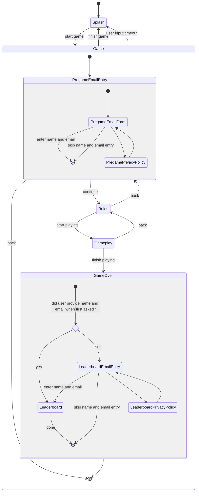
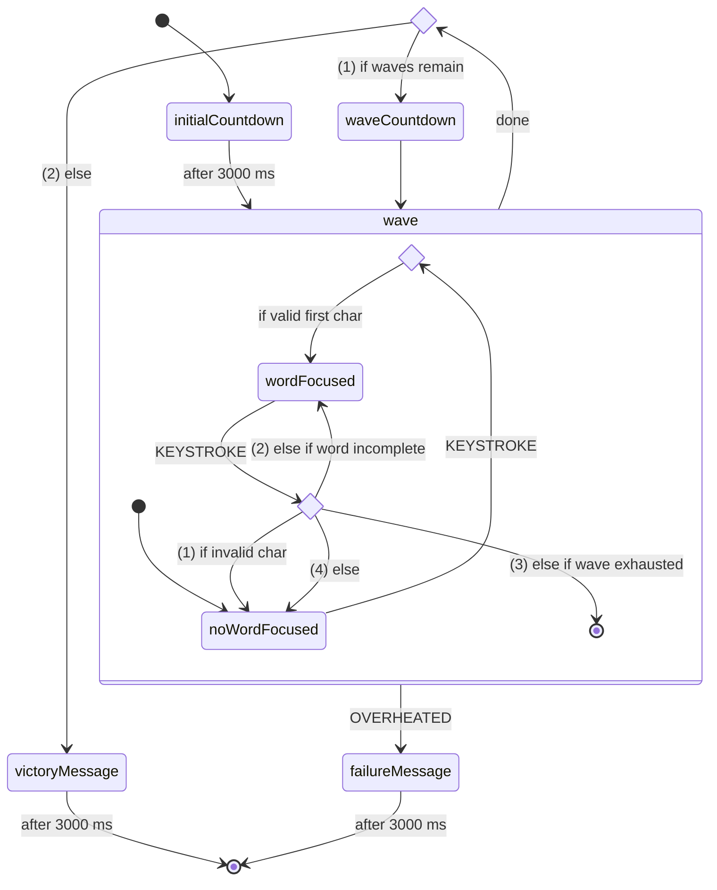

# Frontend

## Design

### App States

#### Splash

- The game's "main menu".
- Should make it obvious to Øredev attendees that they're looking at a game.
- Should be legible and appealing from a distance.
- Sets the tone.

#### Game

- Reset app state back to splash screen at any time if there is no user input for _t_ seconds.
- Display a discreet but obvious message when the user input timeout will be reached in _u_ < _t_
  seconds.
- Leads back to the splash screen when user is done playing, either by finishing the game or by
  using the back button.

##### Pregame Email Entry

- Ask user for name and email address.
- Allow user to skip straight to the game.
- Clarify purpose of name and email address entry.
- Allow user to review privacy policy.

##### Rules

- Simple, bullet-point rules overview.
- Reinforces the tone.

##### Gameplay

- Main gameplay state.

##### Game Over

- Game Over screen with leaderboard.
- Leaderboard displays highest scores and most recent scores.
- Allow user to enter name and email if they haven't already done so.
- Allow user to review privacy policy before entering name and email.
- Allow user to decline entering name and email (if they don't mind not being on the leaderboard).

### Gameplay

#### States

